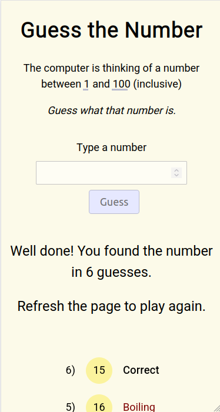
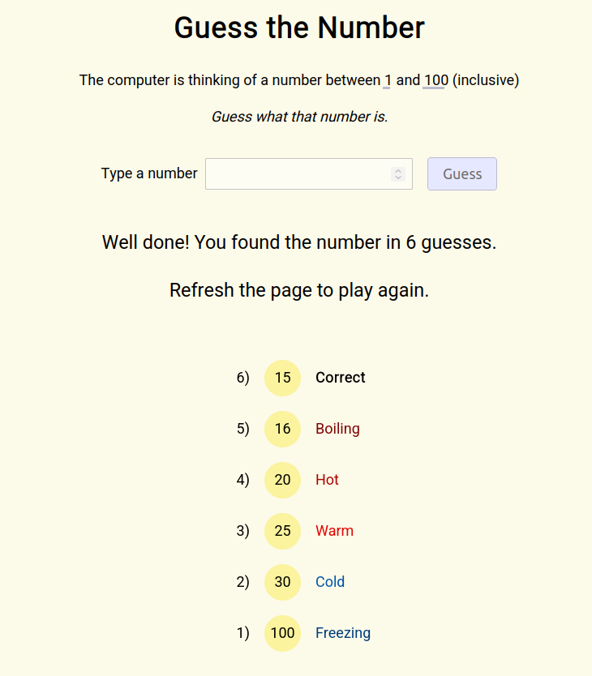

# Guess The Number

A game where you guess the number, but it tells you how warm you are, rather than higher or lower

## Table of contents

- [General info](#general-info)
- [Screenshots](#screenshots)
- [Technologies](#technologies)
- [Setup](#setup)
- [Status](#status)

## General info

A standard guess the number between 1 and 100 game. However, it won't tell you whether your guess is higher or lower but how hot/cold it is based on how close you are. I originally wrote this in JavaScript, then TypeScript. This version I used to test out Vue.

## Screenshots




## Technologies

- Vue
- TypeScript
- SCSS
- Vite

## Setup

To view this project visit the [demo](https://guess-the-number-vue.pages.dev/) or download the files, open a terminal in that folder and install locally using npm:

```
npm install
```

Then run the app locally:

```
npm run dev
```

## Status

Project is: _finished_
